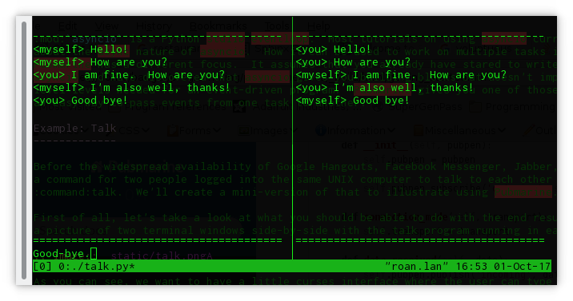

Getting Started
===============

:mod:`asyncio` is a Python stdlib eventloop.  Most tutorials on using asyncio currently talk
about the async nature of asyncio.  How it can be used to work on multiple tasks in parallel.
Pubmarine has a different focus.  It assumes that you already have stared to write a program using
asyncio and have discovered that asyncio gives you building blocks but doesn't implement the higher
level levels needed for an event-driven program.  Pubmarine gives you one of those higher levels:
an easy way to pass events from one task to another.

Example: Talk
-------------

Before the widespread availability of Google Hangouts, Facebook Messenger, Jabber, and AIM there was
a command for two people logged into the same UNIX computer to talk to each other called
:command:`talk`.  We'll create a mini-version of that to illustrate using Pubmarine.

First of all, let's take a look at what you should be able to do with the end result.  Here's
a picture of two terminal windows side-by-side with the talk program running in each one:

As you can see, we want to have a little curses interface in which each user can type short, one-line
messages and have them displayed on the other user's terminal.  Let's take a look at how we achieve
that.

Ye, Olde Imports
~~~~~~~~~~~~~~~~

The first thing to take a look at in our script is the imports.  They're pretty small for this
example program:

.. code-block:: python3

    import asyncio
    import curses
    from functools import partial

    from pubmarine import PubPen

We have :mod:`asyncio`, of course, so that we can multitask between our IO operations and waiting
for user input.  :mod:`curses` handles drawing onto the terminal. :func:`functools.partial` is
a handy utility function that we'll see in action in just a moment.  And from pubmarine, we just
need its workhorse, :class:`PubPen`.

Most of the heavy lifting in this program will be done by :mod:`asyncio` and :mod:`curses`.
:mod:`pubmarine` is a communication channel that will let those two major parts communicate with
each other.

The Network Layer: An Asyncio Protocol
~~~~~~~~~~~~~~~~~~~~~~~~~~~~~~~~~~~~~~

Let's start with the portion that :mod:`asyncio` will be in charge of: connecting each running
instance of our talk program with all the other ones on the box.  In order to handle that, we'll use
a :data:`UNIXsocket <socket.AF_UNIX>`.  This will write a socket file onto the filesystem and any
program which opens that file will be able to participate in the conversation.  We could do this
manually using he :mod:`socket` module from the Python standard library but :mod:`asyncio` provides
us with a helper function that sets up the communication channel to be ready for asynchronous
communications so we'll use that instead:

.. code-block:: python3
    PATH = '/var/tmp/talk.sock'

    loop = asyncio.get_event_loop()
    pubpen = PubPen(loop)
    try:
        # try Client first
        connection = loop.create_unix_connection(partial(TalkProtocol, pubpen), PATH)
        loop.run_until_complete(connection)
    except ConnectionRefusedError:
        # server
        connection = loop.create_unix_server(partial(TalkProtocol, pubpen), PATH)
        loop.run_until_complete(connection)

In this short piece of code we call :func:`asyncio.get_event_loop` to create a vanilla loop that
we're then going to use for all of our program.  You also see your first use of
:class:`~pubmarine.PubPen` here although the only thing we do is initialize it with our
:class:`event loop <asyncio.AbstractEventLoop>` and then use it to initialize the ``TalkProtocol``
class.  As we continue to explore the code, we'll see that we hand this :class:`~pubmarine.PubPen`
to every other class to make use of.  Since it's used to aid communication between parts of the
code, having it available to all of your other objects makes a lot of sense.  If you're not a purist
about global variables, you may want to make a single global :class:`~pubmarine.PubPen` instance
instead of passing it around everywhere.

:meth:`asyncio.AbstractEventLoop.create_unix_connection` is the workhorse in this piece of code.
It's a utility function that sets up a client connection via a UNIX socket file.  You may notice
that the two blocks inside the ``try:`` and the ``except:`` are nearly identical.  The ``except:``
block just calls :meth:`asyncio.AbstractEventLoop.create_unix_server` instead.  This is because we
want our talk program to act like a peer-to-peer program.  Anyone can start the talk program first.
Whoever does so will become the server.  The second person to connect will become a client.
(Starting additional programs would start to run into corner-cases with this strategy but solving
those has nothing to do with :mod:`pubmarine` so we'll leave solving those to some other
demonstration ;-)

Both :meth:`~asyncio.AbstractEventLoop.create_unix_connection` and
:meth:`~asyncio.AbstractEventLoop.create_unix_server` return a :class:`asyncio.Future` which we have
to run on the main loop. We do that via :meth:`~asyncio.AbstractEventLoop.run_until_complete`.
Although we don't need them here, after the :class:`~asyncio.Future` completes it returns two
objects to us: a :class:`Transport <asyncio.BaseTransport>` and a :class:`asyncio.Protocol`.  The
``Transport`` encapsulates getting the bytes from the socket into python in a multitasking-friendly
manner.  The ``Protocol`` encapsulates interpreting those bytes and figuring out what to do with
them later.  We have to write our own ``Protocol`` because the talk service we are implementing
isn't a standard with any existing code for it.

The TalkProtocol class
~~~~~~~~~~~~~~~~~~~~~~

The ``TalkProtocol`` isn't too complicated:

.. code-block:: python3
    class TalkProtocol(asyncio.Protocol):
        def __init__(self, pubpen):
            self.pubpen = pubpen
            self.pubpen.subscribe('outgoing', self.send_message)

        def send_message(self, message):
            self.transport.write(message.encode('utf-8'))

        def connection_made(self, transport):
            self.transport = transport

        def data_received(self, data):
            self.pubpen.publish('incoming', data.decode('utf-8', errors='replace'), "<you>")

        def error_received(self, exc):
            self.pubpen.publish('error', exc)

        def connection_lost(self, exc):
            self.pubpen.publish('conn_lost', exc)
            self.pubpen.loop.stop()

In the class's :meth:`~TalkProtocol.__init__` we see the first real use of the :class:`~pubmarine.PubPen` API.
We use :meth:`pubmarine.PubPen.subscribe` to have the ``TalkProtocol`` watch for ``outgoing``
events.  When one occurs, it will call the :meth:`~TalkProtocol.send_message` callback.
``send_message`` will use the transport layer to send the message out to the other programs
listening on the socket.

:meth:`~pubmarine.PubPen.subscribe` does not care about where the ``outgoing`` event originated.
This allows widely separated parts of your program to talk to each other.  They just both need to
have access to the same :class:`~pubmarine.PubPen` instance in order to communicate.

The other methods in the ``TalkProtocol`` are all methods that :class:`asyncio.Protocol` gives us
the option of implementing.  Each one is a callback that asyncio sends data to when certain things
happen:

* :meth:`~TalkProtocol.connection_made` is called when a connection is established.  Since that
  sends the ``Transport`` to us, we take the opportunity to save it for later use.
* :meth:`~TalkProtocol.data_recieved` is called when data arrives on the connection.  Here we use
  another :class:`~pubmarine.PubPen` method, :meth:`~pubmarine.PubPen.publish` to publish the
  ``incoming`` event.  You can see that we're passing two parameters to the ``incoming`` event:
  a text version of the message and a string representing who is communicating.
  :class:`~pubmarine.PubPen`  does not have strict checking of arguments when an event is
  registered.  It is up to the publishers and subscribers to make sure that the events and callbacks
  have matching arguments.[*]_
* :meth:`~TalkProtocol.error_received` and :meth:`~TalkProtocol.connection_lost` are called when
  those asyncio transport-level conditions occur.  In our code we use
  :meth:`pubmarine.PubPen.publish` to alert other code of the events and then, if the connection is
  lost, we stop the main loop.

.. _[*]: In this example program, the same thing can be said about the event names.  We don't define
    ``incoming``, ``outgoing``, or any of the other event names used here.  However,
    :class:`~pubmarine.PubPen` gives you two options for event names.  The laxer style in this
    example is convenient for rapid development and testing.  If you want to enumerate all of the
    events that you use so that you do not typo one by mistake, however, you can pass a list of
    events to :meth:`pubmarine.PubPen.__init__` and ``PubPen`` will ensure that all event names are
    in that list.

Giving the User Feedback
~~~~~~~~~~~~~~~~~~~~~~~~

The talk program uses :mod:`curses` to display an interface in the terminal for the user.  All of
the ``curses`` code is inside of the :class:`Display` class.

Initializing the Display
^^^^^^^^^^^^^^^^^^^^^^^^

The Display class is defined like this:

.. code-block:: python3

    class Display:
        def __init__(self, pubpen):
            self.pubpen = pubpen

            self.pubpen.subscribe('incoming', self.show_message)
            self.pubpen.subscribe('typed', self.show_typing)
            self.pubpen.subscribe('error', self.show_error)
            self.pubpen.subscribe('info', self.show_error)
            self.pubpen.subscribe('conn_lost', self.show_error)

As you can see, it consists entirely of subscribing various callbacks inside of the display class to
events that are published elsewhere.  (Except for ``typed``, they are all published by the
:class:`TalkProtocol`.  We'll see where ``typed`` comes from shortly.)  Pubmarine's agnosticity
towards where the event was published is good for user interfaces.  A user interface has to respond
to events from many sources: generated by the user, from network events, from timers, from hardware
changes, etc.  Using pubmarine, the user interface doesn't have to be strongly connected to those
objects; instead it can receive notification that the objects have changed via the single shared
:class:`~pubmarine.PubPen` object.

If you've ever programmed with :mod:`curses` before, you may be wondering where the setup of the
screen and initial layout is.  Usually it's in the ``__init__`` of a class but not this time.  In
the example code I make Display into a context manager.  That way the screen can be put into raw
mode for curses when the context manager is entered and restored to cooked mode when the context
manager exits:

.. code-block:: python3

       def __enter__(self):
            self.stdscr = curses.initscr()

            curses.noecho()
            curses.cbreak()
            self.stdscr.keypad(1)

            max_y, max_x = self.stdscr.getmaxyx()

            self.error_buffer = self.stdscr.derwin(1, max_x, 0, 0)

            [... Set up the rest of the screen widgets here ...]

        def __exit__(self, *args):
            curses.nocbreak()
            self.stdscr.keypad(0)
            curses.echo()
            curses.endwin()

            return False

    [...]

    if __name__ == '__main__':
        with Display(pubpen) as display:
            [...]

Callbacks
^^^^^^^^^

The majority of the methods inside of :class:`Display` are callbacks.

[to be finished]

User Interaction
~~~~~~~~~~~~~~~~
[to be finished]

* :meth:`Display.get_ch`
* :class:`UserInput`
* :meth:`UserInput.await_user-input`

Complete Source
~~~~~~~~~~~~~~~

The source code for `the complete program
<https://github.com/abadger/pubmarine/blob/master/examples/talk.py>`_ can be found in the examples
directory of the source tree if you want to download and run it or looked at below if you just want
to see it in its entirety:

.. code-block:: python3

    #!/usr/bin/python3 -tt
    #
    # Copyright: 2017, Toshio Kuratomi
    # License: MIT

    import asyncio
    import curses
    from functools import partial

    from pubmarine import PubPen

    PATH = '/var/tmp/talk.sock'

    class Display:
        def __init__(self, pubpen):
            self.pubpen = pubpen

            self.pubpen.subscribe('incoming', self.show_message)
            self.pubpen.subscribe('typed', self.show_typing)
            self.pubpen.subscribe('error', self.show_error)
            self.pubpen.subscribe('info', self.show_error)
            self.pubpen.subscribe('conn_lost', self.show_error)

        def __enter__(self):
            self.stdscr = curses.initscr()

            curses.noecho()
            curses.cbreak()
            self.stdscr.keypad(1)

            max_y, max_x = self.stdscr.getmaxyx()

            self.error_buffer = self.stdscr.derwin(1, max_x, 0, 0)

            self.separator1 = self.stdscr.derwin(1, max_x, 1, 0)
            sep_txt = b'-' * (max_x - 1)
            self.separator1.addstr(0, 0, sep_txt)

            self.chat_log = self.stdscr.derwin(max_y - 3, max_x, 2, 0)
            self.chat_max_y, self.chat_max_x = self.chat_log.getmaxyx()
            self.current_chat_line = 0

            self.separator2 = self.stdscr.derwin(1, max_x, max_y - 2, 0)
            sep_txt = b'=' * (max_x - 1)
            self.separator2.addstr(0, 0, sep_txt)

            self.input_buffer = self.stdscr.derwin(1, max_x, max_y - 1, 0)
            self.input_max_y, self.input_max_x = self.input_buffer.getmaxyx()
            self.input_current_x = 0
            self.input_contents = ''

            self.stdscr.refresh()
            return self

        def __exit__(self, *args):
            curses.nocbreak()
            self.stdscr.keypad(0)
            curses.echo()
            curses.endwin()

            return False

        async def get_ch(self):
            return await self.pubpen.loop.run_in_executor(None, self.stdscr.getch)

        def get_stdin_data(self, typing_queue):
            self.pubpen.loop.create_task(typing_queue.put(self.stdscr.getch()))

        def show_message(self, message, user):
            # Instead of scrolling, simply stop the program
            if self.current_chat_line >= self.chat_max_y:
                self.pubpen.loop.stop()
                return

            message = "%s %s" % (user, message)

            # Instead of line breaking, simply truncate the message
            if len(message) > self.chat_max_x:
                message = message[:self.chat_max_x]

            self.chat_log.addstr(self.current_chat_line, 0, message.encode('utf-8'))
            self.current_chat_line += 1
            self.chat_log.refresh()

        def show_typing(self, char):
            if char == '\n':
                if self.input_contents == '.':
                    self.pubpen.loop.stop()
                self.pubpen.publish('outgoing', self.input_contents)
                self.show_message(self.input_contents, '<myself>')
                self.clear_typing()
                return

            self.input_current_x += 1
            self.input_contents += char
            self.input_buffer.addstr(0, self.input_current_x - 1, char.encode('utf-8'))
            self.input_buffer.refresh()

        def clear_typing(self):
            self.input_current_x = 0
            self.input_buffer.clear()
            self.input_contents = ''
            self.input_buffer.refresh()

        def show_error(self, exc):
            self.error_buffer.clear()
            self.error_buffer.addstr(0, 0, str(exc).encode('utf-8'))
            self.error_buffer.refresh()

    class UserInput:
        def __init__(self, pubpen, display):
            self.pubpen = pubpen
            self.display = display

        async def await_user_input(self):
            while True:
                char = chr(await self.display.get_ch())
                self.pubpen.publish('typed', char)

    class TalkProtocol(asyncio.Protocol):
        def __init__(self, pubpen):
            self.pubpen = pubpen

            self.pubpen.subscribe('outgoing', self.send_message)

        def connection_made(self, transport):
            self.transport = transport

        def data_received(self, data):
            self.pubpen.publish('incoming', data.decode('utf-8', errors='replace'), "<you>")

        def send_message(self, message):
            self.transport.write(message.encode('utf-8'))

        def error_received(self, exc):
            self.pubpen.publish('error', exc)

        def connection_lost(self, exc):
            self.pubpen.publish('conn_lost', exc)
            self.pubpen.loop.stop()

    if __name__ == '__main__':
        loop = asyncio.get_event_loop()
        pubpen = PubPen(loop)

        with Display(pubpen) as display:
            user_input = UserInput(pubpen, display)
            try:
                # try Client first
                connection = loop.create_unix_connection(partial(TalkProtocol, pubpen), PATH)
                loop.run_until_complete(connection)
            except ConnectionRefusedError:
                # server
                connection = loop.create_unix_server(partial(TalkProtocol, pubpen), PATH)
                loop.run_until_complete(connection)

            task = loop.create_task(user_input.await_user_input())
            loop.run_forever()
            task.cancel()
            try:
                loop.run_until_complete(task)
            except:
                pass

